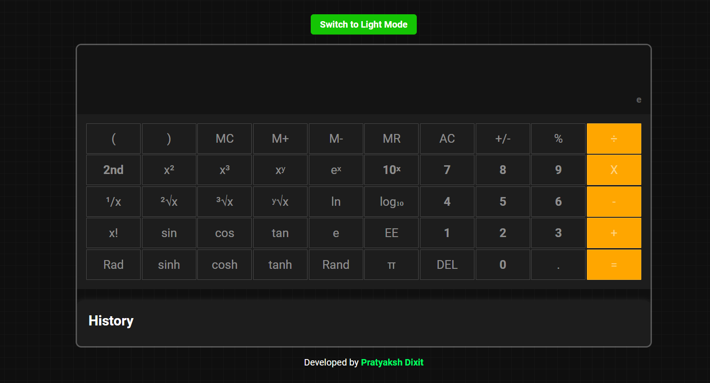

# React + Vite

This template provides a minimal setup to get React working in Vite with HMR and some ESLint rules.

Currently, two official plugins are available:

- [@vitejs/plugin-react](https://github.com/vitejs/vite-plugin-react/blob/main/packages/plugin-react/README.md) uses [Babel](https://babeljs.io/) for Fast Refresh
- [@vitejs/plugin-react-swc](https://github.com/vitejs/vite-plugin-react-swc) uses [SWC](https://swc.rs/) for Fast Refresh

Scientific Calculator
 

A powerful scientific calculator built using Vite and React.

Features
-Basic arithmetic operations (addition, subtraction, multiplication, division)
-Advanced mathematical functions (trigonometric functions, logarithms, exponentials, etc.)
-User-friendly interface
-Demo

You can check out the live demo of the application here.

Installation
Follow these steps to set up the project locally:

Prerequisites
Make sure you have the following installed:

Node.js
npm 
Clone the repository
bash
Copy code
Install dependencies
Using npm

Clone the repository:

git clone https://github.com/Gyanvardhan6205/Mac_os_ScientificCalculator
cd ScientificCalculator Clone

Install dependencies:
 -npm install
 
Run the project:
 -npm run dev

Open http://localhost:5173/ to view it in the browser.

Usage
To use the calculator, simply enter the desired numbers and operations using the provided buttons. The interface includes:

A numeric keypad for entering numbers
Operation buttons for arithmetic and advanced functions
A display that shows the current input and result
Contributing
Contributions are welcome! Please follow these steps to contribute:

Acknowledgements
Vite for the build tool.
React for the JavaScript library.
Math.js (if used) for advanced mathematical functions.